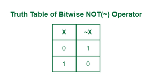
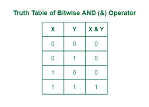
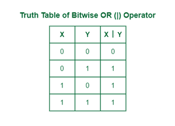
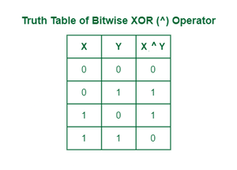

# 1. Bitmark 

Bitmark là một kỹ thuật thực hiện các thao tác các bit để lưu trữ. Thay vì sử dụng một biến riêng cho mỗi cờ (flag), bạn có thể sử dụng bitmask để lưu trữ nhiều giá trị nhị phân.
Bitmask thường được sử dụng để tối ưu bộ nhớ, thực hiện các biện phép toán logic trên một cụm bit, và quan lý các trạng thái, quyền truy cập của đối tượng.
Gỉa sử ta có bình thường sử dụng khai báo 8 đối tượng sẽ mất khá nhiều bộ nhờ hơn thay thì sử dụng một dãy bitmask 8 bit để lưu trữ trạng thái của 8 thiết bị khác nhau. Mỗi thiết bị có thể ở trạng thái bật (1) hoặc tắt (0). 
# 2. NOT bitwise 

NOT bitwise là phép toán làm cho tất cả các bit của giá trị đó sẽ bị đảo ngược: bit 0 sẽ trở thành 1, và bit 1 sẽ trở thành 0.


**Ví dụ**

```c
#include <stdio.h>
#include <stdint.h>

// Hàm in số dưới dạng nhị phân
void print_binary(uint8_t n) {
    for (int i = 7; i >= 0; i--) {  // In từ bit cao đến bit thấp
        printf("%d", (n >> i) & 1);
    }
    printf("\n");
}

int main() {
    uint8_t a = 0b10101010;  // Ví dụ số nhị phân 8 bit
    uint8_t result = ~a;     // Thực hiện phép NOT trên 8 bit

    printf("Original: ");
    print_binary(a);  // In số gốc dưới dạng nhị phân

    printf("NOT: ");
    print_binary(result);  // In số sau khi NOT

    return 0;
}
```
**Kết quả**
```c
Original: 10101010
NOT: 01010101
```
# 3. AND Bitwise

AND Bitwise thực hiện so sánh từng cặp bit tương ứng giữa hai số:
- Nếu cả hai bit giống nhau thì sẽ cho ra kết là 1 
- Nếu cả hai bit khác nhau thì ra cho ra kết quả là 0


**Ví dụ**

```c
#include <stdio.h>
#include <stdint.h>

// Hàm in số dưới dạng nhị phân
void print_binary(uint8_t n) {
    for (int i = 7; i >= 0; i--) {  // In từ bit cao đến bit thấp
        printf("%d", (n >> i) & 1);
    }
    printf("\n");
}

int main() {
    uint8_t a = 0b10101010;  // Ví dụ số nhị phân 8 bit
    uint8_t b = 0b00111111;
    uint8_t result = a &b;     // Thực hiện phép NOT trên 8 bit

    printf("Original a: ");
    print_binary(a);  // In số gốc dưới dạng nhị phân
    printf("Original b: ");
    print_binary(b);
    printf("a & b: ");
    print_binary(result);  // In số sau khi NOT

    return 0;
}
```
**Kết quả**

```c
Original a: 10101010
Original b: 00111111
a & b: 00101010
```

# 4. OR Bitwise

OR Bitwise thực hiện phép hoặc bit của từng số giữa hai số. Kết quả là 1 nếu có hơn 1 bit là 1 ngược lại là 0.

```c
#include <stdio.h>
#include <stdint.h>

// Hàm in số dưới dạng nhị phân
void print_binary(uint8_t n) {
    for (int i = 7; i >= 0; i--) {  // In từ bit cao đến bit thấp
        printf("%d", (n >> i) & 1);
    }
    printf("\n");
}

int main() {
    uint8_t a = 0b10101010;  // Ví dụ số nhị phân 8 bit
    uint8_t b = 0b00111111;
    uint8_t result = a | b;     // Thực hiện phép NOT trên 8 bit

    printf("Original a: ");
    print_binary(a);  // In số gốc dưới dạng nhị phân
    printf("Original b: ");
    print_binary(b);
    printf("a & b: ");
    print_binary(result);  // In số sau khi NOT

    return 0;
}
```
**Kết quả**
```c
Original a: 10101010
Original b: 00111111
a & b: 10111111
```

# 5. XOR bitwise 
Phép XOR bitwise (Exclusive OR) thực hiện so sánh từng cặp bit tương ứng giữa hai số:

Nếu hai bit khác nhau (một là 0 và một là 1), kết quả là 1.
Nếu hai bit giống nhau (cả hai cùng là 0 hoặc cùng là 1), kết quả là 0.


```c
#include <stdio.h>
#include <stdint.h>

// Hàm in số dưới dạng nhị phân
void print_binary(uint8_t n) {
    for (int i = 7; i >= 0; i--) {  // In từ bit cao đến bit thấp
        printf("%d", (n >> i) & 1);
    }
    printf("\n");
}

int main() {
    uint8_t a = 0b10101010;  // Ví dụ số nhị phân 8 bit
    uint8_t b = 0b00111111;
    uint8_t result = a ^ b;     // Thực hiện phép NOT trên 8 bit

    printf("Original a: ");
    print_binary(a);  // In số gốc dưới dạng nhị phân
    printf("Original b: ");
    print_binary(b);
    printf("a & b: ");
    print_binary(result);  // In số sau khi NOT

    return 0;
}
```
**Kết quả**
```c
Original a: 10101010
Original b: 00111111
a & b: 10010101
```

# 6. Shift left bitwise

Dùng để di chuyển bit sang trái nghĩa là các bit ở bên phải sẽ được dịch sang bên trái , và các bit thay thế các bit sau khi dịch sẽ là bit 0
```c
#include<stdio.h>
#include<stdint.h>
// Hàm in số dưới dạng nhị phân

void print_binary(uint8_t n) {
    for (int i = 7; i >= 0; i--) {  // In từ bit cao đến bit thấp
        printf("%d", (n >> i) & 1);
    }
    printf("\n");
}
int main()
{
    uint8_t a= 0b10100110;
    uint8_t shift_value= a <<4;

    printf("Original a: ");
    print_binary(a);

    printf("Shift_left_value a : ");
    print_binary(shift_value);
}
```
**Kết quả**
```c
Original a: 10100110
Shift_left_value a : 01100000
```
# 7. Shift right bitwise
```c
```

Dùng để di chuyển bit sang phải nghĩa là các biên ở bên trái sẽ được dịch sang bên phải, và các bit thay thế các bit sau khi dịch sẽ là bit 0 
```c
#include<stdio.h>
#include<stdint.h>
// Hàm in số dưới dạng nhị phân

void print_binary(uint8_t n) {
    for (int i = 7; i >= 0; i--) {  // In từ bit cao đến bit thấp
        printf("%d", (n >> i) & 1);
    }
    printf("\n");
}
int main()
{
    uint8_t a= 0b10100110;
    uint8_t shift_value= a >>4;

    printf("Original a: ");
    print_binary(a);

    printf("Shift_left_value a : ");
    print_binary(shift_value);
}
```
**Kết quả**
```c
Original a: 10100110
Shift_left_value a : 00001010
```

**Bit field**
Bit field là kỹ thuật chỉ định các thành viên trong struct chiếm số lượng bit cụ thể bằng dấu ```:```. Điều này giúp tiết kiệm bố nhớ khi bạn chỉ cần lưu trữ một số lượng nhỏ các bit thay vì sử dụng cả một kiểu dữ liệu lớn như ```int``` hoặc ```char```.
**Cú pháp**
```c
struct <tên_cấu_trúc> {
    <kiểu_dữ_liệu> <tên_trường>: <số_bit>;
};
```

**Ví dụ**
```c
#include <stdio.h>
#include <stdint.h>

#define ENABLE 1
#define DISABLE 0

typedef struct {
    uint8_t LED1 : 1;   
    uint8_t LED2 : 1;
    uint8_t LED3 : 1;
    uint8_t LED4 : 1;
    uint8_t LED5 : 1;
    uint8_t LED6 : 1;
    uint8_t LED7 : 1;
    uint8_t LED8 : 1;
} LEDStatus;

void displayAllStatusLed(LEDStatus status) {
    uint8_t* statusPtr = (uint8_t*)&status;
        for (int j = 0; j < 8; j++) {
            printf("LED%d: %d\n", j+1, (*statusPtr >> j) & 1);
        }
    
}


int main() {
    LEDStatus ledStatus = {.LED7 = ENABLE, .LED5 = ENABLE};

    // Bật LED 1 và 3
    ledStatus.LED1 = ENABLE;
    ledStatus.LED3 = ENABLE;
    displayAllStatusLed(ledStatus);

    return 0;
}
```
**Kết quả**
```c
LED1: 1
LED2: 0
LED3: 1
LED4: 0
LED5: 1
LED6: 0
LED7: 1
LED8: 0
```
Ý nghĩa : Ban đầu trạng thái thì sẽ enable led 7 và led 5 sau đó sẽ bật thêm led 1 và led 3 và trạng thái các led khác sẽ tắt (0).