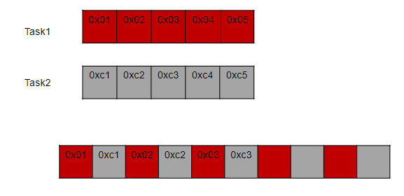

#  Pthread
## 1. Đặt vấn đề
```c
#include<stdio.h>
 
void  delay1s ()
{
    for (int i=0;i<100000000;i++);

}
void task1(){
    static int count =0;
    count ++;
    printf(" COUNT TASK1 :%d\t",count);
    delay1s();
}
void task2(){
    static int count=0;
    count ++;
    printf("Count task2: %d \n",count);
    delay1s();
}
int main (int argc, char const*argv[])
{
    while(1)
    {
        task1();
        task2();
    }
}
```
Giả sử chương trình thực hiện hai tác vụ liên tục (task1, task2), nếu đặt trong while(1) thì thực hiện tuần tự, task1 thực hiện xong thì mới thực hiện task2.
Muốn cả 2 tác vụ trên thực thi song song với nhau thì làm thế nào? 

## 2. Thread 
- Thread (Luồng ) là đơn vị thực thi nhỏ nhất của mộ tiến trình. Mỗi tiến trình có thể chứa nhiều thread, và các thread này chạy song song với nhau, 
- Các thread trong cùng tiến trình chia sẻ tài nguyên với nhau những sẽ có stack và bộ đếm chương trình riêng biệt.
- Đa luồng (multithreading) là kỹ thuật trong lập trình mà một tiến trình (process) có thể tạo ra và quản lý nhiều luồng (threads) hoạt động đồng thời.

 
 ## 3. Thư viện pthread.h
 ```pthread``` là thư viện tiêu chuẩn cho lập trình đa luồng C/C++.
 Hàm ```pthread_create``` được sủ dụng tạo một thread mới 
 ```c
 int pthread_create(pthread_t *th, const pthread_attr_t *attr, void*(*func)(void*),void *arg);
```
```pthread_t *th```: một con trỏ trỏ tới một biến ```pthread_t``` để lưu trữ ID của thread mới được tạo ra. Có thể sử dụng ID này để tham chiếu đến thread sau khi tạo nó (Ví như như đợi thread kết thức với pthread_join)
```const pthread_attr_t *attr```: Đây là một con trỏ tới một biến thuộc kiểu pthread_attr_t, định nghĩa các thuộc tính của thread mới. Nếu muốn tạo một thread với các thuộc tính mặc định, hãy đặt giá trị này là NULL.

```void *(*start_routine)(void *)```: Con trỏ tới hàm mà thread mới sẽ thực thi. Hàm này phải có định dạng void *function(void *arg). Khi thread mới được tạo, nó sẽ bắt đầu chạy từ hàm này.

```void *arg```: Tham số sẽ được truyền vào hàm start_routine. Tham số này thường được sử dụng để truyền dữ liệu cho thread. Nếu không cần tham số, có thể truyền NULL.
Chương trình ở dưới nên chạy ở trên ```https://www.onlinegdb.com/online_c_compiler``` bởi trình biên dịch ở VScode có thể chưa có pthread.
**Ví dụ**
```c
#include<stdio.h>
#include<pthread.h>
#include <unistd.h>
void *task1(void *data)
{
    static int i=0;
    while (1)
    {
        printf("count task1: %d\n",i++);
        sleep(1);
    }
}
void *task2(void *data)
{
    static int i=0;
    while (1)
    {
        printf("count task2: %d\n",i++);
        sleep(3);
    }
}
void *display(char *a)
{
    while (1){
        printf("%s\n",a);
        sleep(1);
    }
}
int main (int argc, char const *argv[])
{   
    pthread_t t1,t2,t3;
    pthread_create(&t1, NULL,task1, NULL);
    pthread_create(&t2, NULL,task2, NULL);
    while(1){}
}

````
