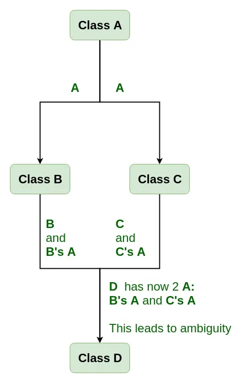

# Virtual function 
## 1. Đa hình tại thời điểm chạy (Run-time Polymorphism)
Đa hình tại thời điểm chạy xảy ra khi việc quyết định method nào (phiên bản class hay của class con) sẽ được gọi ra ngay tại thời điểm chạy chương trình.
Ưu điểm là giúp cho chương trình linh hoạt hơn, cho phép việc mở rộng chức năng mà không cần sửa đổi mã nguồn hiện tại 
Tính đa hình thực hiện bằng cách sử dụng hàm ảo ở class cha và ghi đè ở class con 

** Hàm ảo (Virtual function)**

Hàm ảo là một hàm thành viên được khai báo trong class cha với từ khóa **virtual**
Khi một hàm là virtual, nó có thể được ghi đề (override) trong class con để cung cấp cách triển khai riêng.
**Ví dụ**
```c
class Doituong {
protected:
    string ten;
    int id;
public:
    Doituong() {
        static int ID = 20210001;
        id = ID;
        ID++;
    }
    void setName(string name) {
        ten = name;
    }
    virtual void display() {
        cout << "Ten: " << ten << endl;
        cout << "ID: " << id << endl;
    }
};
```
**Override** là việc ghi đè hàm ở class con bằng cách định nghĩa lại nó.
Muốn ghi đề thì sử dụng từ khóa **override** trong class con để cung cấp một phiên bản triển khai riêng của class con. 

**Ví dụ**
```c
// Class cha
class Animal {
public:
    // Hàm ảo
    virtual void sound() {
        cout << "Animal makes a sound." << endl;
    }
};

// Class con - Dog
class Dog : public Animal {
public:
    // Ghi đè
    void sound() override {
        cout << "Dog barks." << endl;
    }
};
```
Khi gọi một hàm ảo thông qua một con trỏ hoặc tham chiếu đến lớp con, hàm sẽ được quyết định dựa trên đối tượng thực tế mà con trỏ hoặc tham chiếu đang trỏ tới chứ không dựa vào kiểu của con trỏ.

**Ví dụ**
```c
#include <iostream>
using namespace std;

// Class cha
class Animal {
public:
    // Hàm ảo
    virtual void sound() {
        cout << "Animal makes a sound." << endl;
    }
};

// Class con - Dog
class Dog : public Animal {
public:
    // Ghi đè
    void sound() override {
        cout << "Dog barks." << endl;
    }
};

// Class con - Cat
class Cat : public Animal {
public:
    // Ghi đè
    void sound() override {
        cout << "Cat meows." << endl;
    }
};

int main() {
    Dog dog;
    Cat cat;

    // Con trỏ kiểu class cha trỏ tới các đối tượng của class con   
    Animal* ptr[] = { &dog, &cat };

    // Gọi hàm ảo thông qua con trỏ
    ptr[0]->sound(); // Kết quả: "Dog barks."
    ptr[1]->sound(); // Kết quả: "Cat meows."
    
    // Tham chiếu kiểu class cha tham chiếu đến các đối tượng của class con
    Animal& animalRef1 = dog;
    Animal& animalRef2 = cat;

    // Gọi hàm ảo thông qua tham chiếu
    animalRef1.sound(); // Kết quả: "Dog barks."
    animalRef2.sound(); // Kết quả: "Cat meows."

    return 0;
}
```


**Ví dụ**
```c
#include <iostream>
#include <string>

using namespace std;

class Doituong {
protected:
    string ten;
    int id;
public:
    Doituong() {
        static int ID = 20210001;
        id = ID;
        ID++;
    }
    void setName(string name) {
        ten = name;
    }
    virtual void display() {
        cout << "Ten: " << ten << endl;
        cout << "ID: " << id << endl;
    }
};

class SinhVien : public Doituong {
protected:
    string chuyenNganh;
public:
    void setTen(string name) {
        setName(name);
    }
    void setNganh(string nganh) {
        chuyenNganh = nganh;
    }
    void display() override{ // override để ghi đè phương thức display của lớp cha
        // Doituong::display();
        cout << "Ten: " << ten << endl;
        cout << "ID: " << id << endl;
        cout << "Chuyen nganh: " << chuyenNganh << endl;
    }
};

class HocSinh : public Doituong {
protected:
    string lop;
public:
    void setTen(string name) {
        setName(name);
    }
    void setLop(string khoi) {
        lop = khoi;
    }
    void display() override{ // override để ghi đè phương thức display của lớp cha
        cout << "Ten: " << ten << endl;
        cout << "ID: " << id << endl;// Ghi đè phương thức display của lớp cha{
        // Doituong::display();
        cout << "Lop: " << lop << endl;
    }
};

int main() {
    SinhVien sv1;
    sv1.setTen("Hoang Long Vu");
    sv1.setNganh("Ky thuat o to");
    // sv1.display();

    cout << endl;

    HocSinh hs1;
    hs1.setTen("Nguyen Van A");
    hs1.setLop("10A1");
    // hs1.display();

    Doituong *dt1;

    dt1 = &sv1; // Con trỏ lớp cha trỏ đến đối tượng lớp con
    dt1->display(); // Gọi phương thức display của lớp con SinhVien

    dt1 = &hs1; // Con trỏ lớp cha trỏ đến đối tượng lớp con
    dt1->display(); // Gọi phương thức display của lớp con HocSinh

    cout << endl;

    Doituong *ptr[] = {&sv1, &hs1}; // Mảng con trỏ lớp cha trỏ đến các đối tượng lớp con
    ptr[0]->display(); // Gọi phương thức display của lớp con SinhVien
    ptr[1]->display(); // Gọi phương thức display của lớp con HocSinh
    return 0;
}
```
## 2. Hàm ảo thuẩn túy (Pure virtual function)
Hàm ảo thuần túy là một hàm ảo không có phần định nghĩa trong class cha được khai báo với cú pháp =0 và khiến class cha trở thành class trừu tượng và chúng ta không thể tạo đối tượng từ class trừu tượng. 

**Ví dụ**
```c
class Doituong {
protected:
    string ten;
    int id;
public:
    Doituong() {
        static int ID = 20210001;
        id = ID;
        ID++;
    }
    void setName(string name) {
        ten = name;
    }
    virtual void display() =0; // Phương thức ảo thuần túy, bắt buộc lớp con phải định nghĩa lại không được khai báo lại
};
```

```c
class Animal {
public:
    virtual void sound() = 0; // Hàm ảo thuần túy
};

// Do something ...

int main(){
    // Lỗi: không thể khởi tạo đối tượng từ lớp trừu tượng
    Animal animal; 
}
```
**Tuy nhiên ta có thể khai báo object với con trỏ hoặc tham chiếu thay vì đối tượng vì nó có phương thức ảo thuần túy**
```c
#include <iostream>
#include <string>

using namespace std;

class Doituong {
protected:
    string ten;
    int id;
public:
    Doituong() {
        static int ID = 20210001;
        id = ID;
        ID++;
    }
    void setName(string name) {
        ten = name;
    }
    virtual void display() =0; // Phương thức ảo thuần túy, bắt buộc lớp con phải định nghĩa lại không được khai báo lại
};

class SinhVien : public Doituong {
protected:
    string chuyenNganh;
public:
    void setTen(string name) {
        setName(name);
    }
    void setNganh(string nganh) {
        chuyenNganh = nganh;
    }
    void display() override{ // override để ghi đè phương thức display của lớp cha
        // Doituong::display();
        cout << "Ten: " << ten << endl;
        cout << "ID: " << id << endl;
        cout << "Chuyen nganh: " << chuyenNganh << endl;
    }
};

class HocSinh : public Doituong {
protected:
    string lop;
public:
    void setTen(string name) {
        setName(name);
    }
    void setLop(string khoi) {
        lop = khoi;
    }
    void display() override{ // override để ghi đè phương thức display của lớp cha
        cout << "Ten: " << ten << endl;
        cout << "ID: " << id << endl;// Ghi đè phương thức display của lớp cha{
        // Doituong::display();
        cout << "Lop: " << lop << endl;
    }
};

int main() {
    SinhVien sv1;
    sv1.setTen("Hoang Long Vu");
    sv1.setNganh("Ky thuat o to");
    // sv1.display();

    cout << endl;

    HocSinh hs1;
    hs1.setTen("Nguyen Van A");
    hs1.setLop("10A1");
    // hs1.display();

    Doituong *dt1; // vẫn là con trỏ lớp cha nhưng không thể khởi tạo đối tượng lớp cha được vì có phương thức ảo thuần túy

    dt1 = &sv1; // Con trỏ lớp cha trỏ đến đối tượng lớp con
    dt1->display(); // Gọi phương thức display của lớp con SinhVien

    dt1 = &hs1; // Con trỏ lớp cha trỏ đến đối tượng lớp con
    dt1->display(); // Gọi phương thức display của lớp con HocSinh

    cout << endl;

    Doituong *ptr[] = {&sv1, &hs1}; // Mảng con trỏ lớp cha trỏ đến các đối tượng lớp con
    ptr[0]->display(); // Gọi phương thức display của lớp con SinhVien
    ptr[1]->display(); // Gọi phương thức display của lớp con HocSinh

    
    return 0;
}

```
**GIẢI THÍCH**
- Trình biên dịch xem một class trừu tượng có chứa hàm ảo thuần túy là chưa được định nghĩa đầy đủ. Do đó, không thể tạo đối tượng trực tiếp từ class trừu tượng.

- Con trỏ có thể trỏ đến nullptr hoặc bất kỳ đối tượng nào. Vì vậy, con trỏ kiểu class trừu tượng có thể khai báo mà không cần trỏ đến một đối tượng cụ thể.

- Tham chiếu phải tham chiếu đến một đối tượng cụ thể ngay khi được khởi tạo và không thể thay đổi đối tượng mà nó tham chiếu sau khi khởi tạo. Do đó, để không xảy ra lỗi, tham chiếu đến class trừu tượng phải tham chiếu ngay đến một đối tượng của class con.
## 3. Đa kế thừa

Đa kế thừa trong C++ cho phếp một class kế thừa từ nhiều class khác.
Đa kế thừa thường dùng để kết hợp các chức năng từ nhều class.

**Ví dụ**

```c
#include <iostream>
#include <string>

using namespace std;
class A {
    public:
        void displayA() {
            std::cout << "This is class A" << std::endl;
        }
    };
    
    // Class cha B
    class B: public A {
    public:
        void displayB() {
            std::cout << "This is class B" << std::endl;
        }
    };
    
    // Đa kế thừa
    class C : public A {
    public:
        void displayC() {
            std::cout << "This is class C" << std::endl;
        }
    };
    class D : public B,public C {
    public:
        void displayD() {
            std::cout << "This is class D" << std::endl;
        }
    };
    
    int main() {
        D obj;
        // obj.displayA(); // cái này không lỗi nhưng không biết gọi cái nào từ trong class nào cả
        obj.B::displayA(); // Gọi phương thức từ class A thông qua class B
        obj.B::displayB(); // Gọi phương thức của lớp B  thông uống lớp B
        obj.C ::displayA(); // Gọi phương thức của lớp A thông qua lớp C
        obj.C::displayC(); // Gọi phương thức của lớp B thông qua lớp C
        obj.D::displayB(); // Gọi phương thức của lớp B thông qua lớp D
        obj.D::displayC(); // Gọi phương thức của lớp C thông qua lớp D
        obj.displayD(); // Gọi phương thức của lớp D
        return 0;
    }
    // obj.B::displayA(); đây là cách gọi phương thức của lớp A thông qua lớp B phải có tên lớp B:: trước tên phương thức
```
**Diamond Problem**
Diamond problem xảy ra khi một lớp con kế thừa từ hai lớp cha và cả hai lớp cha này đều kế thừa từ một lớp cha chung. Điều này dẫn đến tính hướng lớp con có thể chứ các thuốc tính hoặc phương thức trùng tên từ lớp cha chung, gây ra xung đột trong việc xác định nên sử dụng thành phần nào. 

## 4. Kế thừa ảo 
Kế thừa ảo giúp vấn đề diamond problem trong đa kế thừa 
Chỉ có một bản sao duy nhất của lớp cở sở chung được kế thừa 
Kế thừa ảo giuos cho quản lý các class liên quan đến phần cừng và giao tiếp. Điều này giúp cho tránh trùng lặp lại tài nguyên và quản lý hiệu quả trong hệ thống nhúng.
**Ví dụ**
```c
#include<iostream>
#include<string>

using namespace std;
class A{
    public:
        void displayA(){
            cout << "This is class A" << endl;
        }
};
class B: virtual public A{
    public:
        void displayB(){
            cout << "This is class B" << endl;
        }
};
class C: virtual public A, virtual public B{
    public:
        void displayC(){
            cout << "This is class C" << endl;
        }
};
class D: virtual public C{
    public:
        void displayD(){
            cout << "This is class D" << endl;
        }
};
int main ()
{
    D objD;
    objD.A::displayA(); // Gọi phương thức displayA() từ lớp A
    objD.B::displayA(); // Gọi phương thức displayA() từ lớp B
    objD.C::displayA(); // Gọi phương thức displayA() từ lớp C
    objD.C::displayB(); // Gọi phương thức displayB() từ lớp C
    objD.C::displayC(); // Gọi phương thức displ yC() từ lớp C
    objD.displayC(); // Gọi phương thức displayC() từ lớp C
    objD.displayD(); // Gọi phương thức displayD() từ lớp D
    objD.displayA(); // Gọi phương thức displayA() từ lớp D phiên bản duy nhất trong class D

}
// Để khắc phục vấn đề khi có nhiều class cha kế thừa từ một class cha khác, ta sử dụng từ khóa virtual trong khai báo lớp con.
// sử dụng từ khóa virtual trong khai báo lớp con để đảm bảo rằng chỉ có một bản sao của lớp cha được tạo ra trong cây kế thừa.
```