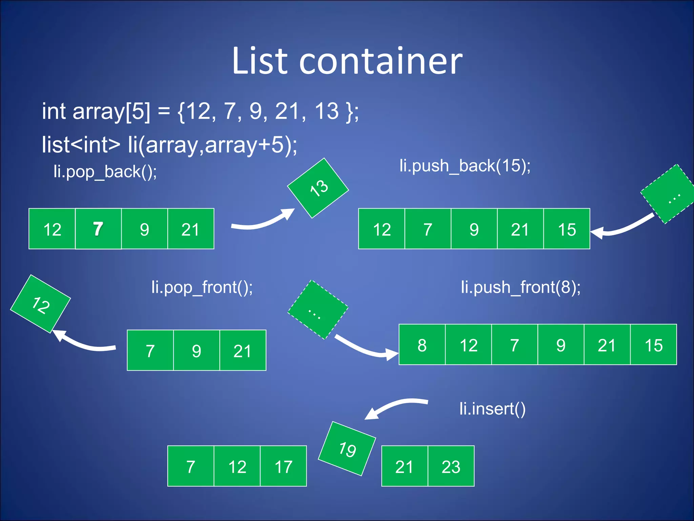

# Standard template library
Standard Template Library là một thưc viện trong ngôn ngữ lập trình C++ cung cấp một tập hợp các template classesa và functions để thực hiện nhiều loại cấu trúc dữ liệu vafcacs thuật toán phổ biến.
Một số thành phần chính của STL:
- Container
- Iterator
- Algorithms
- Functor
## 1. Container 
Container alf cách gọi chung cho các cấu trức dữ liệu tông quát để lưu trữ và quản lý các đối tượng (hoặc dữ liệu) theo một cách thức nhất định 
### 1.1 Vector 
Nó cung cấp một mảng động với khả năng thay đổi kích thước một cách linh hoạt. 
Vì là một mảng nên nó cho phép truy cập nhanh vào các phần từ thông qua chỉ số (index).
**Ví dụ**
```c
#include <iostream>
#include <vector>

using namespace std;
int main (int argc, char const *argv[])
{
    vector <int> arr= {21,44,25,11,31,8,3}; // những phần tử có địa chỉ được cấp ở phân vùng heap nhưng bản thân giá trị của arr được cấp ở phân vùng stack 
    arr.size(); // size() là một hàm của vector nên nó sẽ trả về số lượng phần tử của vector
    for (size_t i=0;i <arr.size();i++)
    {
        cout << "Value :" << arr.at(i) << endl;
        // cout  << "VALUE : " << arr[i] << endl;
    }
}
```
Một số method của vector:
- at(): Truy cập vào phần tử của vector
- size(): Trả về kích thước của vector
- resize(): Thay đổi kích thước của vector
- begin(): Địa chỉ của phần tử đầu tiên của vector
- end(): Địa chỉ của phần tử cuối cùng của vector
- push_back(): Thêm phần tử vào vị trí cuối của vector

**Ví dụ**
```c
#include <iostream>
#include <vector>

using namespace std;
int main (int argc, char const *argv[])
{
    vector <int> arr= {21,44,25,11,31,8,3}; // những phần tử có địa chỉ được cấp ở phân vùng heap nhưng bản thân giá trị của arr được cấp ở phân vùng stack 
    arr.size(); // size() là một hàm của vector nên nó sẽ trả về số lượng phần tử của vector
    // for (size_t i=0;i <arr.size();i++)
    // {
    //     cout << "Value :" << arr.at(i) << endl;
    //     // cout  << "VALUE : " << arr[i] << endl;
    // }
    arr.push_back(30); // thêm phần tử vào cuối mảng

    arr.push_back(40);   // thêm phần tử vào cuối mảng

    arr.pop_back(); // sẽ tự động xóa đi phần tử cuoi cùng của mảng
    arr.insert(arr.begin(), 10); // thêm phần tử vào đầu mảng
    arr.insert(arr.end(), 20); // thêm phần tử vào cuối mảng
    arr.insert(arr.begin()+3,6);  // thêm phần tử vào vị trí thứ 3 nếu muốn thêm vị trí như thế nào thì sẽ cộng nên số cộng thêm vào bởi index của arr.begin () có index=0;
    // for (auto &i : arr)
    for (const auto &index: arr) // vòng lòng for cải tiến ở đây const dùng để đọc auto tự động suy diễn dứ liệu  
    {
        cout << "Value : " << index << endl; // khong can phải gọi ra arr.at(index)
       
    }


    return 0;

}
// kiểu dữ liệu size_t dùng để tính kích của cái mảng  size_t n = sizeof(arr)/sizeof(arr[0]); // sizeof trả về kích thước của mảng 
```
Cách thức hoạt động của vector 

### 1.2 List
Cung cấp dưới dạng danh sách liên kết hai chiều.
Cho phép thao tác với các phần từ tương tự như vector nhưng hiệu quả vì không yêu cầu về cấp phát bộ nhớ.
**Một số method của List**
push_back():
pop_back():
insert(): Chèn một node vào list
erase(): Xóa một node của list
size(): Trả về kích thước của list

**Cách hoạt đông của List**
 

 **Ví dụ**
 ```c
 vector<int> arr = {2, 5, 1, 5, 6};
    cout << "before" << endl;
    for (int i = 0; i < arr.size(); i++)
        cout << "element: " << arr[i] << endl;

    arr.at(2) = 10; // change value 

    arr.resize(8);  // realloc memory 

    arr.insert(arr.begin(), 12); //push new element to the front of vector

    arr.push_back(18); // push new element to the end of vector   

    arr.erase(arr.begin()); //delete begin element of vector

    cout << "after" << endl;
    for (int i = 0; i < arr.size(); i++)
        cout << "element: " << arr[i] << endl;
 ```

 **Ví dụ**
 ```c
 #include <iostream>
#include <list>

using namespace std;

int main(int argc, char const *argv[])
{
    list<int> arr;

    arr.push_back(1);
    arr.push_back(23);
    arr.push_back(34);
    arr.push_back(41);
    arr.push_back(50);
    arr.push_front(0);
    arr.push_front(-1);

    list<int>::iterator it = arr.begin();
    int index = 0;

    for (it = arr.begin(); it != arr.end();)
    {
        if (index == 2)
        {
            it = arr.insert(it, 2); // Thêm vào vị trí index
            ++it; // Cập nhật iterator sau khi insert
        }
        else if (index == 3)
        {
            it = arr.erase(it); // Xóa phần tử tại vị trí index và cập nhật iterator
            continue; // Không tăng iterator vì erase đã trả về iterator mới
        }
        else
        {
            ++it; // Chỉ tăng iterator nếu không insert hoặc erase
        }
        index++;
    }

    for (it = arr.begin(); it != arr.end(); ++it)
    {
        cout << "Value : " << *it << endl;
    }

    return 0;
}
 ```
**SO SÁNH VECTOR VÀ LIST**

Cả vector và list đều dùng để lưu trữ dữ liệu tuy nhiên lựa chọn cái nào để sử dụng tối ưu nhất sẽ phụ thuộc vào các trường hợp sau

Sử dụng list khi:

+ thao tác sửa,thêm,xóa liên tục: tói ưu hơn so với vector vì địa chỉ của các node không cố định và liền kể nhau -> không phải cấp phát lại memory như vector

+ Ít truy cập ngẫu nhiên: do phải dùng còn trõ để duyệt qua từng node -> tốn thời gian

+ Yêu cầu về bộ nhớ hệ thống không hạn chế:do list tốn thêm memory để lưu trữ con trỏ liên kết

=> Ví du: quản lý task queue hoặc lưu trữ dữ liệu giao tiếp qua UART theo thời gian thực

Sử dụng vector khi

+ Dữ liệu có kích thước cố định và ít thay đổi
+ cần truy cập ngẫu nhiên nhanh chóng
=> ví dụ: lưu trữ dữ liệu ADC hoặc truyền qua SPI

### 1.3 Map 
Cung cấp dữ liệu ánh xạ key value
Map lưu trữ các phần từ dưới dạng cặp key value, trong đó mỗi key phải là duy nhất trong map 

**Ví dụ**
```c
#include<iostream>
#include<map>
using namespace std;

int main (int argc, char const *argv[])
{
    map <int,string> arr;
    arr[0] ="Hoang";
    arr[1] ="Long " ;
    arr[2]="Vu";   // nếu mà để arr[1] thì nó sẽ in ra key 1 và value là Vu những cái key phải là duy nhất (khác nhau ) tức nó lấy key sau cùng 

    for (const auto &index :arr)
    {
        cout<< "Key"<<index.first <<", value: "<<index.second <<endl;

    }
}
```
**Ví dụ**
```c
#include <map>
#include <iostream>
#include <string>

using namespace std;

int main() {
    map<string, int> myMap;

    map<string,int> ::iterator it;

    // Thêm phần tử vào map
    myMap["one"] = 1;
    myMap["two"] = 2;
    myMap["three"] = 3;
    myMap.insert(make_pair("four", 4));
    myMap.erase("one");

    for (auto const var : myMap)
    {
        cout << "Key: " << var.first << " , " << "Value: " << var.second << endl;
    }
    
   
    for (it = myMap.begin(); it != myMap.end(); ++it)
    {
        cout << "Key: " << (*it).first << " , " << "Value: " << (*it).second << endl;
    }
    // Phần này sử dụng thêm cả interator để hiển thị
    

    return 0;
}

```

### 1.4 Array
Array là mọt container có kích thước cố định và có sẵn trong thư viện STL, được xác định tại thời điểm biên dịch và không thể thay đổi sau khi được khai báo 
Array hỗ trợ truy cập ngẫu nhiên vào các phần từ thông qua toán tử ```[]```.
 ```c
 #include <iostream>
 #include <array>
 
 using namespace std;
 
 
 int main()
 {
   
     array <int, 5> arr = {2,3,1,7,6};
 
     if (arr.empty())
     {
         cout << "Array is empty" << endl;
     }
     else
     {
         cout << "Array it not empty" << endl;
     }
     
 
     for (int i = 0; i < arr.size(); i++)
     {
         cout << "Value: " << arr.at(i) << endl;
     }
     
 
     return 0;
 }
 
 ```

## 2.Iterator 
Iterator cung cấp một cách chung để duyệt qua các phần tử của một container mà không cần biết chi tiết về cách container được triển khai.
Iterator là một đối tượng cho phép truy cập tuần tự qua các phần tử của một container.
Nó giống như con trỏ, cho phép di chuyển qua các phần tử trong container.

```c
#include <iostream>
#include <vector>

int main() {
    // Tạo một vector chứa các số nguyên
    std::vector<int> numbers = {1, 2, 3, 4, 5};

    // Sử dụng iterator để duyệt qua các phần tử trong vector
    std::cout << "Các phần tử trong vector: ";
    for (std::vector<int>::iterator it = numbers.begin(); it != numbers.end(); ++it) {
        std::cout << *it << " ";
    }
    std::cout << std::endl;

    // Sử dụng iterator để sửa đổi các phần tử trong vector
    for (std::vector<int>::iterator it = numbers.begin(); it != numbers.end(); ++it) {
        *it *= 2; // Nhân đôi giá trị của mỗi phần tử
    }

    // In lại các phần tử sau khi sửa đổi
    std::cout << "Các phần tử sau khi sửa đổi: ";
    for (std::vector<int>::iterator it = numbers.begin(); it != numbers.end(); ++it) {
        std::cout << *it << " ";
    }
    std::cout << std::endl;

    return 0;
}
```
## 3. Algorithm
### 3.1 Thuật toán For_Each()
Được sử dụng để duyệt qua từng phần tử của 1 dãy giá trị đầu vào và thực thi 1 hàm hoặc lambda trên từng phần tử
**Cú pháp:**
```c
std::for_each(InputIterator first, InputIterator last, Function func);
```
+ first: con trỏ đến phần tử đầu

+ last: con trỏ đến ngay sau phần tử cuối cùng

+ func: hàm hoặc lambda thực thi trên từng phần tử
**In ra các phần tử**
```c
vector<int> vec = {1, 2, 3, 4, 5};

//sử dụng lambda để xây dựng hàm in 
auto print =  [](int x) {cout << x << " ";};
for_each(vec.begin(), vec.end(),print);
```
**Thay đổi giá trị các phần tử**
```c
vector<int> vec = {1, 2, 3, 4, 5};
auto change = [](int& x){x*=2;};
for_each(vec.begin(),vec.end(),change);
for(auto i : vec)
   cout << i << " " << endl;
```
**Tính tổng các phẩn tử**
```c
vector<int> vec = {1, 2, 3, 4, 5};
int sum = 0;
auto tong = [&sum](int x){sum += x;};
for_each(vec.begin(), vec.end(),tong);
cout << "sum :" << sum;
```
### 3.2 Thuật toán find()
Được sử dụng để tìm phần tử đầu tiên trong dãy có giá trị khớp với giá trị được cung cấp
**Cú pháp**
```c
emplate<class InputIterator, class T> InputIterator find(InputIterator first, InputIterator last, const T& value);
```
+ first , last : iterator xác định phạm vi tìm kiếm

=> Hàm này trả về con trỏ đ16n phần tử đầu tiên bằng với value. Nếu không tìm thấy trả về
**Ví dụ**
```c
vector<int> vec = {10, 20, 30, 40, 50};
auto it = find(vec.begin(), vec.end(), 30);
if (it != vec.end())
    cout << "Found: " << *it << endl;
else
    cout << "Not found" << endl;
```
### 3.3Thuật toán sort()
Được sử dụng để sắp xếp các phần tử theo thứ tự tăng/giảm dần
### 3.4Thuật toán merge()
Được sử dụng để hợp nhát 2 dãy đã được sắp xếp thành 1 dãy.
