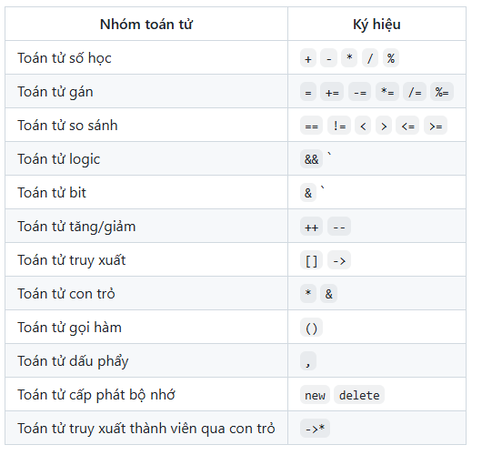
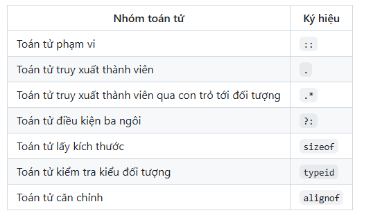

# Mẫu (Templates) 

Mẫu trong C++ là một tính năng mạnh mẽ cho phép các hàm và lớp hoạt động với các kiểu dữ liệu tổng quát. Điều này có nghĩa là bạn có thể viết một hàm hoặc lớp duy nhất để làm việc với nhiều kiểu dữ liệu khác nhau mà không cần viết lại mã cho từng kiểu.

## Các loại mẫu

### 1. Mẫu hàm (Function Templates)
Mẫu hàm cho phép bạn tạo một hàm duy nhất có thể làm việc với các kiểu dữ liệu khác nhau.

#### Cú pháp:
```cpp
template <typename T>
T functionName(T parameter) {
    // Thân hàm
}
```

#### Ví dụ:
```cpp
#include <iostream>
using namespace std;

template <typename TypeA, typename TypeB>
auto add(T a, T b) {
    return a + b;
}

int main() {
    cout << "Cộng số nguyên: " << add(3, 5) << endl;       // Kết quả: 8
    cout << "Cộng số thực: " << add(2.5, 4.3) << endl;    // Kết quả: 6.8
    // cout << "Cộng một số nguyên với một số thực: "<< add(1,4.3) << endl;  // Nó sẽ báo lỗi vì hai tham số không cùng kiểu dữ liệu
    return 0;
}
```
**Ví dụ** Cách khắc phục ví dụ trước là sử dụng từ khóa ```auto``` bởi khi kiểu trả về nó khá là thụ động của vào typeA dẫn tới kết quả sai .
```cpp
cout << "Sum: " << sum(1, 5.6) << endl;  // Kết quả: "Sum: 6"
```
Từ khóa auto được sử dụng để tự động suy luận kiểu dữ liệu của biến hoặc kiểu trả về của hàm dựa trên giá trị mà gán cho nó.
```cpp
#include<iostream>
using namespace std;

template <typename TypeA, typename TypeB>
auto add(TypeA a, TypeB b) {
    return a + b;
}

int main ()
{
    cout << "Sum: "<< add(3, 5) << endl;       // Kết quả: 8
    cout << "Sum: "<< add(2.5, 4.3) << endl;    // Kết quả: 6.8
    cout << "Sum: "<< add(1,4.3) << endl;  // Nó sẽ báo lỗi vì hai tham số không cùng kiểu dữ liệu
}
```
### 2. Mẫu lớp (Class Templates)
Mẫu lớp cho phép bạn định nghĩa một khuôn mẫu cho lớp có thể xử lý bất kỳ kiểu dữ liệu nào.
Class templates cho phép bạn viết một class tổng mà có thể sử dụng với nhiều kiểu dữ liệu khác nhau 

**Sử dụng cho kiểu dữ liệu đơn giản**


#### Cú pháp:
```cpp
template <typename T>
class ClassName {
    T data;
public:
    ClassName(T value) : data(value) {}
    void display() {
        cout << data << endl;
    }
};
```

#### Ví dụ:
```cpp
#include <iostream>
using namespace std;

template <typename T>
class Box {
    T value;
public:
    Box(T v) : value(v) {}
    void show() {
        cout << "Giá trị: " << value << endl;
    }
};

int main() {
    Box<int> intBox(10);
    Box<string> strBox("Xin chào Templates");

    intBox.show();       // Kết quả: Giá trị: 10
    strBox.show();       // Kết quả: Giá trị: Xin chào Templates
    return 0;
}
```
```c
#include<iostream>

using namespace std;

template <typename T>

class Sensor {
    private:
        T value;

    public:
        Sensor(T init) : value(init) {}

        void readSensor(T newValue){
            value = newValue;
        }
        T getValue(){
            return value;
        }
        void displayValue(){
            cout << "Sensor value: " << value << endl;
        }
};

int main ()
{   // ở đây bắt buộc phải truyền vào kiểu dữ liệu của tham số đầu vào là int, double, string
    Sensor<int> intSensor(10);
    intSensor.displayValue(); // Output: Sensor value: 10

    Sensor<double> doubleSensor(3.14);
    doubleSensor.displayValue(); // Output: Sensor value: 3.14

    Sensor<string> stringSensor("OFF");
    stringSensor.displayValue(); // Output: Sensor value: Hello
    return 0;
}
```z
**Kết quả**
```c
Sensor value: 10
Sensor value: 3.14
Sensor value: OFF
```
**Sử dụng cho kiểu dữ liệu phức tạp**
### 3. Chuyên biệt hóa mẫu (Template Specialization)
Chuyên biệt hóa mẫu cho phép bạn tùy chỉnh hành vi của một mẫu cho một kiểu dữ liệu cụ thể.
```c
#include<iostream>

using namespace std;
class Temperature{
    private: 
        double temperature;
    public: // Gioi hạn phạm vi khi có const thì không cần phải khai báo lại biến trong hàm
        double getValue()const{
            return 40.5;
        }
        string getUnit()const{
            return "Celsius";
        }

};
class TirePressure{
    public:
        int getValue()const{
            return 32;
        }
        string getUnit()const{
            return "PSI";
        }
    private:
};
template <typename Sensor1, typename Sensor2>
class VehicleSensor{
    private:
        Sensor1 sensor1;
        Sensor2 sensor2;
    public:
        VehicleSensor(Sensor1 s1, Sensor2 s2): sensor1(s1), sensor2(s2){}
        void displaySensorData(){
            cout << "Sensor 1: " << sensor1.getValue() << " " << sensor1.getUnit() << endl;
            cout << "Sensor 2: " << sensor2.getValue() << " " << sensor2.getUnit() << endl;
        }  
};
int main(){
    Temperature tempSensor;
    TirePressure tireSensor;
    VehicleSensor<Temperature, TirePressure> vehicleSensor(tempSensor, tireSensor);
    vehicleSensor.displaySensorData();
    return 0;
}
```

#### Ví dụ:
```cpp
#include <iostream>
using namespace std;

template <typename T>
class Printer {
public:
    void print(T value) {
        cout << "Tổng quát: " << value << endl;
    }
};

// Chuyên biệt hóa cho kiểu char
template <>
class Printer<char> {
public:
    void print(char value) {
        cout << "Ký tự: " << value << endl;
    }
};

int main() {
    Printer<int> intPrinter;
    Printer<char> charPrinter;

    intPrinter.print(42);      // Kết quả: Tổng quát: 42
    charPrinter.print('A');    // Kết quả: Ký tự: A
    return 0;
}
```

## Operator overloading
Nạp chồng toán tử là định nghĩa lại cách hoạt động của một số toán tử (toán tử có sẵn trong C++) sử dụng cho các object của class tự định nghĩa các object đó không thể tính toán như các biến thông thường 
Các toán tử có thể nạp chồng (Overloadable Operators)


Các toán tử không thế nạp chồng (Non- Overloadble)

## Ưu điểm của Mẫu
- Tái sử dụng mã.
- An toàn kiểu dữ liệu.
- Giảm sự lặp lại mã.

## Hạn chế của Mẫu
- Có thể tăng thời gian biên dịch.
- Thông báo lỗi có thể phức tạp và khó gỡ lỗi.
- Không phải tất cả các trình biên dịch đều hỗ trợ các tính năng mẫu nâng cao.

Mẫu là một tính năng quan trọng trong C++ để viết mã tổng quát và tái sử dụng. Chúng được sử dụng rộng rãi trong Thư viện Mẫu Chuẩn (STL) cho các container như `vector`, `list`, và các thuật toán như `sort`, `find`, v.v.
**Pass by Value**
Tham trị là cách truyền tham số vào hàm mà giá trị của tham số được sao chép vào một biến cục bố bên trong hàm 
Khi truyền tham trị, một bản sao của giá trị gốc được tạo ra làm bộ nhớ RAM phình lê, và chỉ làm việc với bản sao này. 
Do đó, mọi thay đổi trên tham số bên trong hàm sẽ chỉ ảnh hưởng đến bản sao, không ảnh hưởng đến giá trị của biến ban đầu ở bên ngoài hàm.
**Ví dụ**
```c
#include <iostream>
using namespace std;

void increment(int x) {
    x = x + 1; // Thay đổi x chỉ ảnh hưởng trong phạm vi của hàm này
}

int main() {
    int a = 5;
    increment(a);
    cout << "Giá trị của a sau khi gọi increment: " << a << endl; // a vẫn là 5
    return 0;
}
```
**Pass by reference**
Truyền tham chiếu là truyền một chiếu đến biến gốc(địa chỉ của nó) tức là bạn đang trực tiếp trên biến ban đầu
Bất kỳ sự thay đổi nào trên tham số trong hàm sẽ ảnh hưởng trực tiếp đến biến gốc
**Ví dụ**
```c
#include<iostream>

using namespace std;
void value(int &data)
{
    data=10;
}
int main (){
    int a=5;
    value(a);
    cout<<"Gia tri cua a sau :" <<a<< endl;
}
```
**Ứng dụng của tham chiếu và tham trị**

```cpp
Fraction operator * (const Fraction& other) {
    // Công thức: (a/b) * (c/d) = (a*c) / (b*d)
    int new_numerator = numerator * other.numerator;
    int new_denominator = denominator * other.denominator;
    return Fraction(new_numerator, new_denominator);
}
```

Truyền tham chiếu (const Fraction&other)
- Không tạo bản sao của other, mà sử dụng tham chiếu đến đối tượng ban đầu.

- Giúp tiết kiệm bộ nhớ và tăng tốc độ khi làm việc với các đối tượng lớn hoặc phức tạp.

- const đảm bảo rằng đối tượng other sẽ không bị thay đổi bên trong hàm, giúp giữ nguyên giá trị ban đầu của other._
Truyền tham trị (Fraction other)
- Tạo ra bản sao của other khi gọi hàm
- Điều này tốn thêm bộ nhớ để lưu trữ bản sao của other và có thể làm chậm hiệu suất nếu Fraction là một đối tượng phức tạp
