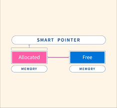
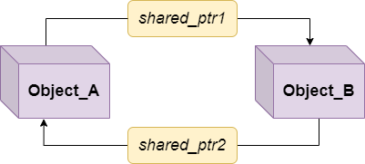

có 3 loại smart pointer, 
Unique pointer 
Shared pointer 
weak pointer 

bản thân ptr năm ở phân vùng stack còn địa chỉ nó chỉ đến thì nằm ở phân vùng heap 
# Smart pointer
## 1. Con trỏ thô (Raw pointer)
Đây là con trỏ cơ bản được khai báo đơn giản thông qua toán tử * mà không được quản lý bởi bất kỳ một đối tượng hay lớp nào. 
Nó cung cấp 1 số chức năng sau:
- Quản lý địa chỉ của vùng nhớ mà nó trỏ đến
- Thao tác với vùng nhớ tại địa chỉ đó
**Tuy nhiên nó không cung cấp bất kỳ chức năng nào để kiểm soát vùng nhớ mà nó trỏ đến. Vì vậy ta có thể mắc phar lỗi như**
```c
- Truy xuất giá trị không hợp lệ do vùng nhớ mà nó trỏ đến đã bị thu hồi
int* ptr = new int(12);
delete ptr;
cout << "value: " << *ptr // error -> dereference undefined memory
```
- Vùng nhớ bị rò rỉ khi ta quên giải phóng
```c
int* ptr = new int(12);
//memory leak issue 
```
- Không có cơ chế kiểm tra phạm vi của vùng nhớ mà nó quản lý 
```c
int* ptr = new int[6]; //allocate heap with 5 element
arr[10] = 20 // truy cập vào vùng nhớ chưa được cấp phát -> lỗi undefined behaviour
delete[] arr;
```
Chính vì vậy ta sẽ cần 1 cách hiệu quả hơn để giải quyết những vấn đề một cách tự động. Smart pointer sẽ cung cấp những tính năng cho phép ta làm được điều đó.
## Thế nào là Smart pointer 
Đây là 1 class template cung cấp những method cho phép ta quản lý vùng nhớ với lợi ích như tự động giải phóng vùng nhớ để tránh các lỗi phổ biến khi sử dụng với raw pointer như

- memory leak (rò rỉ bộ nhớ)
- dangling pointer (con trỏ lơ lửng -> không trỏ đến vùng nhớ xác định)

## 2. Các loại smart pointer 
### 2.1 Unique pointer 

**Đặc điểm**
- Dùng để quản lý duy nhất duy nhất đối tượng 
- Không cho phép đối tượng đó bị sao chép hoặc trỏ đến bởi raw pointer của các object khác
- Các method bên trong vẫn có thể được truy cập bởi các con trỏ khai báo ngoài phạm vi 
- Có thể chuyển giao quyền sở hữu sang một object khác 
**Class mô phỏng lại cách hoạt động của unique pointer:**
```c
#include <iostream>

using namespace std;

template <typename T>
class UniquePointer
{
private:
    T *ptr; // con trỏ quản lý bộ nhớ

public:
    // constructor nhận vào 1 con trỏ thô
    UniquePointer(T *p = nullptr) : ptr(p) {}

    // destructor: giải phóng bộ nhớ khi đối tượng bị hủy
    ~UniquePointer()
    {
        if (ptr)
        {
            delete ptr;
        }
    }
    /*
     * địa chỉ uptr: 0xf4 - stack
     *
     */

    // xóa bỏ khả năng copy để đảm bảo chỉ có 1 pointer sở hữu object
    UniquePointer(const UniquePointer &) = delete;
    UniquePointer &operator=(const UniquePointer &) = delete;

    // toán tử dereference (*) để truy cập giá trị, trả về địa chỉ của pointer
    T &operator*() const
    {
        return *ptr;
    }

    // toán tử -> để truy cập thành viên của con trỏ
    T *operator->() const
    {
        return ptr;
    }

    // trả về con trỏ thô bên trong (nếu cần)
    T *get() const
    {
        return ptr;
    }

    // giải phóng quyền sở hữu và trả về con trỏ thô, không xóa đối tượng
    T *release()
    {
        T *temp = ptr;
        ptr = nullptr;
        return temp;
    }

    // thay thế con trỏ hiện tại bằng 1 con trỏ mới
    void reset(T *p = nullptr)
    {
        if (ptr)
        {
            delete ptr;
        }
        ptr = p;
    }
};
```

```cpp
class Sensor
{
private:
    float value1;
    float value2;
public:
    /*cach 2*/
    Sensor(float init1 = 23.21,float init2 = 12.21){
        value1 = init1;
        value2 = init2;
    }
    ~Sensor(){
        cout <<"call destructor" << endl;
    }
    float getValue1()
    {
        return value1;
    }
    float getValue2()
    {
        return value2;
    }
    void setValue1(float value1){
        this->value1 = value1;
    }
    void display()
    {
        cout << "sensor1 value: " << getValue1() << endl;
        cout << "sensor2 value: " << getValue2() << endl;
    }
};
```
**Khai báo 1 objec smart pointer**
```c
#include <iostream>
#include <memory>
using namespace std;
int main()
    unique_ptr<Sensor> uptr = make_unique<Sensor>(1); 

    //truy cập và đọc giá trị mặc định ban đầu
    uptr->display(); // cach 2 : (*uptr).display(); 
```
**Sử dụng hàm get()**
- **Chức năng** : trả về raw pointer được quản lý bởi smart pointer để truy cập vào vùng nhớ mà nó quản lý (không thay đổi quyền sở hữu)
**Lưu ý**: Raw pointer trả về từ get sẽ tự động thu hồi bởi smart pointer, nếu chủ động delete có thể gây lỗi 
```c
int main(){
    unique_ptr<Sensor> uptr = make_unique<Sensor>(1);
    Sensor *rawptr = uptr.get();
    rawptr->setValue1(100.21);
    rawptr->display();
    return 0;
}
```
**Sử dụng hàm release**
- Chức năng :giải phóng quyền sở hữu của smart pointer đối với đối tượng mà nó quản lý, trả về raw pointer đến đối tượng mà nó quản lý
**Lưu ý** Raw pointer trả về lúc này không còn dược quản lý bởi smart pointer, phải  chủ động giải phóng bằng **delete**

```c
int main(){
    unique_ptr<Sensor> uptr = make_unique<Sensor>(1);
    Sensor *rawptr = uptr.get();
    rawptr->setValue1(100.21);
    rawptr->display();
    return 0;
}
```
**Sử dụng hàm reset**
Chức năng : giải phóng đối tưởng hiện tại nếu có, trước khi quản lý đối tướng mới 
```void reset()``` giải phóng đối tướng hiện tịa và đặt thành null 
```void reset()``` giải phóng đối tượng hiện tại và bắt đầu quản lý đối tượng được chỉ định bởi ptr
```cpp
int main(){
  unique_ptr<Sensor> uptr = make_shared<Sensor>(1);
  uptr->setValue1(98.23);
  uptr->display();

  //giải phóng và thay đổi đối tượng mới
  uptr.reset(new Sensor(20));
  uptr->display();

  //giải phóng vùng nhớ
  uptr.reset();

  return 0;

}
```
**Sử dụng hàm remove**
- Chức năng: Chuyển giao quyền sở hữu đối tượng hiện tại, hay nói các khác raw pointer của smart pointer mà quản lý vùng nhớ này sẽ được chuyển sang cho smart pointer khác. 
```c
int main(){
    unique_ptr<Sensor> uptr = make_shared<Sensor>(1);
    uptr->setValue1(98.23);
    uptr->display();
    
    //chuyển giao quyền sỏ hữu
    unique_ptr<Sensor> uptr2 = move(uptr); 
    uptr2->display();

    return 0;
```

### 2.2 Share pointer
 
 Nhiều con trỏ có thể cùng chia sẽ quyền sở hữu vùng nhớ của một đối tượng
 Chỉ khi tất cả các shared_ptr trỏ đến đối tượng đó bị thu hồi, vùng nhớ của đối tượng mới được giải phóng. 
**Hàm make_shared<T>(args)**
```c
#include <iostream>
#include <memory>

using namespace std;

int main() {
    shared_ptr<int> sPtr1 = make_shared<int>(20); 
    
    // sptr2 cùng trỏ đến đối tượng mà sptr1 đang quản lý
    shared_ptr<int> sPtr2 = sPtr1;
    shared_ptr<int> sPtr3 = sPtr1
    return 0;
}
```
**Hàm used_count()**
Hàm này trả về số lượng shared_ptr đang cùng chia sẻ quyền sở hữu đối với đối tượng
```cpp
int main() {
    shared_ptr<int> sPtr1 = make_shared<int>(20); 

    shared_ptr<int> sPtr2 = sPtr1;
    
    {
        shared_ptr<int> sPtr3 = sPtr1;
        cout << sPtr1.use_count() << endl;  // 3 (sPtr1, sPtr2, sPtr3)
    }

    // sPtr3 đã ra khỏi phạm vi
    cout << sPtr1.use_count() << endl;  // 2 (sPtr1, sPtr2)

    return 0;
}
```
**Toán tử -> và *, get(), reset(), release(), move()**
```cpp
int main() {
    shared_ptr<int> sPtr1 = make_shared<int>(20); 

    shared_ptr<int> sPtr2 = sPtr1;

    cout << *sPtr1 << endl; // 20
    cout << *sPtr2 << endl; // 20

    /* -> dùng để truy cập các thành viên của 
     * đối tượng kiểu class ý như unique pointer. 
     */

    return 0;
}
```

**Toán tử swap()**
```c
int main() {
    shared_ptr<int> sPtr1 = make_shared<int>(20); 
    shared_ptr<int> sPtr2 = make_shared<int>(30);

    cout << sPtr1 << endl;  // 0x00
    cout << sPtr2 << endl;  // 0x04

    sPtr1.swap(sPtr2);

    cout << sPtr1 << endl;  // 0x04
    cout << sPtr2 << endl;  // 0x00

    cout << *sPtr1 << endl; // 30
    cout << *sPtr2 << endl; // 20

    return 0;
}
```
### 2.3 Share pointer


**Đặc điểm**
- Được sử dụng để giám sát các share pointer thông qua việc sử dụng 1 tham chiếu yếu đến 1 đối tượng quản lý bởi share pointer
- Cung cấp 1 cơ chế theo dõi an toàn mà không làm tăng bộ đếm tham chiếu của share pointer
**Sử dụng hàm lock()**
Chức năng: trả về 1 share_ptr hợp lệ được dùng để truy cập vào đối tượng bằng việc theo dõi nó thông qua weak_ptr
```c

int main()
{

    shared_ptr<HinhChuNhat> ptr1(new HinhChuNhat(40, 10));
    shared_ptr<HinhChuNhat> ptr3 = ptr1; 
    weak_ptr<HinhChuNhat> ptr2 = ptr1;

    if (auto ptr_lock = ptr2.lock())
    {
        ptr_lock->tinhDienTich();
    }
    else
    {
        cout << "Object has been deallocated" << endl;
    }
    cout <<"counts: " << ptr2.use_count() << endl; // trả về số lượng share pointer không tính weak pointer
    return 0;
}
```
## 3. Ứng dụng của smart pointer trong embedded system
**Quản lý bộ nhớ heap**: việc sử dụng heap memory thích cho hệ thống nhúng vì yêu cầu hạn chế về tài nguyên. Do đó việc sử dụng smart pointer có thể tối ưu hóa việc quản lý bộ nhớ

**Quản lý tài nguyên chung**: Khi ta cần chia sẻ vùng nhớ giữa các thành phần như 1 buffer chứa dữ liệu cảm biến

**Tránh rò rỉ vùng nhớ:** việc quản lý vùng nhớ bằng smart pointer là tự động vì vậy sẽ giảm thiểu được lỗi liên quan đến bộ nhớ so với việc dùng raw pointer