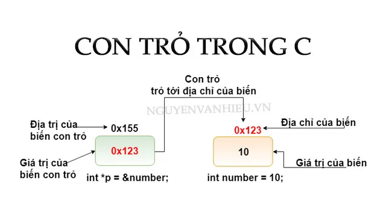

# Pointer 
## Khái niệm về con trỏ 
- Con trỏ là một biến chứa địa chỉ bộ nhớ của một đối tượng khác. 
-Đối tượng này có thể là biến, hàm , mảng hay là con trỏ khác.


**Cú pháp**
```c
int *ptr;     // con trỏ kiểu int 
float *ptr;   // con trỏ kiểu float
char *ptr;    // con trỏ kiểu char       
```
Con trỏ ptr sẽ trỏ tới biến a ngay khi nó được khởi tạo

```c
  int a = 34;
  int* ptr = &a;
```
Để lấy giá trị con trỏ ptr chính là đấy địa chỉ của biến a, trong khi sử dụng toán tử truy xuất * sẽ in ra giá trị tại địa chỉ đó.
```c
printf("Địa chỉ a: %p", &a);
printf("Gia trị ptr:%p", ptr); // giá trị ptr này là địa chỉ của a;
```
### Ứng dụng con trỏ 
#### Con trỏ hàm (Funtion pointer) 
Con trỏ hàm lưu địa chỉ của một hàm, cấu trúc khai báo như sau :
```c
(*pointer_name)(input parameter)
```
**Ví dụ**
```c
#include<stdio.h>
void print(){
	printf("Hello Word");
}
int main(){
	void (*ptr)();	
	ptr= print;// gán địa chỉ hàm print cho con trỏ ptr
	ptr(); // gọi con trỏ ptr để thực hiện hàm print
}

```
**Ví dụ**
```c
#include<stdio.h>
#include<assert.h>
void tong(int a,int b)
{
    printf("Tong  cua 2 so %d va %d  la: %d\n",a,b,a+b);
} 
void hieu (int a, int b)
{
    printf("Hieu cua 2 so %d va %d la: %d\n",a,b,a-b);
}
void tich(int a, int b)
{
    printf("Tich cua 2 so %d va %d la: %d\n",a,b,a*b);
}
void thuong(int a ,int b)
{
    assert (b!=0);
    printf("Thuong cua 2 so %d va %d la: %f \n",a,b,(double)a/b);
}
int main()
{
    void (*array[4])(int, int ) = {&tong, &hieu, &tich, &thuong};
    array[0](2,3);
    array[1](2,3);
    array[2](2,3);
    array[3](2,3);
}
```
Từ mảng gọi ra các hàm 
**Ví dụ**
```c
#include<stdio.h>
#include<assert.h>
void tong(int a,int b)
{
    printf("Tong  cua 2 so %d va %d  la: %d\n",a,b,a+b);
} 
void hieu (int a, int b)
{
    printf("Hieu cua 2 so %d va %d la: %d\n",a,b,a-b);
}
void tich(int a, int b)
{
    printf("Tich cua 2 so %d va %d la: %d\n",a,b,a*b);
}
void thuong(int a ,int b)
{
    assert (b!=0);
    printf("Thuong cua 2 so %d va %d la: %f \n",a,b,(double)a/b);
}
void tinhtoan(void(*ptr)(int,int),int a,int b)
{
    printf("Thuc hien phep toan:\n");
    ptr(a,b);
}
int main ()
{
    tinhtoan(&tong,31,8);
    return 0;
}

```

### Con trỏ void 
Con trỏ void dùng đẻ trỏ tới bất kì địa chỉ nào mà không cần biết trước dữ liệu của địa chỉ đó. Và muốn lấy giá trị của con trỏ thì ta phải ép kiểu theo đúng định dạng kiểu dữ liệu mà con trỏ đó trỏ tới. 
**Ví dụ**

```c
#include <stdio.h>

void tong (int a, int b)
{
    printf("Tong hai so %d và %d la %d\n", a, b, a + b);
}
int main ()
{
    int a =4;
    
    char c='H';

    double h= 11.3;

    void *ptr =&a;

    printf("Gia tri cua bien : %p\n", ptr);
    printf("Gia tri cua bien : %d\n", *(int*)ptr);
    ptr =&c;
    printf("Gia tri cua bien : %p\n", ptr);
    printf("Gia tri cua bien : %c\n", *(char*)ptr);
    ptr =&h;
    printf("Gia tri cua bien : %p\n",   ptr);
    printf("Gia tri cua bien : %f\n", *(double*)ptr);
    ptr =&tong;
    printf("Gia tri cua bien : %p\n", ptr);
    
    ((void (*)(int , int ))ptr)(9,4);

    
}
 

```
### Con trỏ ```NULL```
NULL pointer là một con trỏ không trỏ đến bất kỳ đối tượng hoặc vùng nhớ cụ thể nào. Khi khai báo ``` int *ptr```  không biết con trỏ này trỏ tới vị trí nào bởi nó luôn được cấp phát đại chỉ được gọi là địa chỉ rác bởi có thể nó trùng với đại chỉ của một biến và địa chỉ của một hàm nó đó dãn tới xung đột chương trình vậy nên quy tắc code là khi khai báo con trỏ thì cần khai báo con trỏ NULL.
```c
#include <stdio.h>

int main()
{
    int *ptr=NULL;
    printf("Pointer is %p\n", ptr);
    if (ptr != NULL)
    {
        printf("Pointer is NOT NULL\n"); 
    }
    else
    {
        printf("Pointer is NULL\n");
    }
}
```
**Kết quả**
```c
Pointer is 0000000000000000
Pointer is NULL

```
Con trỏ NULL có giá trị bằng 0 và địa chỉ bằng 0.
### Kích thước của con trỏ 
Kích thước của con trỏ phụ thuộc vào kiến trúc vi xử lý 8 byte(64bit) và 4 byte (32bit).
Kích thước của con trỏ p được in bằng cách sử dụng hàm sizeof().
```c
#include <stdio.h>
int main ()
{
    printf("Size: %lu byte \n", sizeof(int *));
    printf("Size: %lu byte", sizeof(double *));  
}
```
## Con trỏ hằng (Pointer tp constant)
Là cách định nghĩa một con trỏ không thể thay đổi giá trị tại địa chỉ mà nó trỏ đến thông qua dereference nhưng giá trị tại đại chỉ đó có thể thể thay đổi.

Cú pháp :
```c
int const * ptr_const;
const int  *ptr_const;
```
Gỉả sử có những cái biến nhập vào thì cái hàm chỉ đọc giá trị biến x, y ra thì input parameter là một biến còn nếu có nhu cầu biến có thể thay đổi giá trị truyền vào thì phải sử dụng con trỏ. 
**Ví dụ**
```c
#include <stdio.h>

int main() {
    int a = 6;
    int b = 8;
    const int* ptr = &a;

    printf("%d\n", *ptr);  // 6

    // Gán địa chỉ mới
    ptr = &b;
    printf("%d\n", *ptr);  // 8

    // Error: assignment of read-only location '*ptr'
    // *ptr = 3;

    return 0;
}
```
### Constant pointer (Hằng con trỏ)
Hằng con trỏ là con trỏ mà đến địa chỉ cố định. Nghĩa là
**Cú pháp**
```c
int *const const_ptr= &value;
```
 

 ```c
 int *const PORTA = 0x0010101001010;

```
nhưng ta có thể truy cập tới địa chỉ để thay đổi giá trị và không thể dùng PORTA để truy cập đến địa chỉ khác 

### Pointer to pointer (con trỏ đến con trỏ)

Con trỏ đến con trỏ là một kiểu dữ liệu cho phép lưu trữ địa chỉ của một con trỏ.

Nó cung cấp một cấp bậc trỏ mới, cho phép thay đổi giá trị của con trỏ gốc.

Cấp bậc này có thể hữu ích trong nhiều tình huống, đặc biệt là khi làm việc với các hàm cần thay đổi giá trị của con trỏ.
**Cú pháp**
```c
int **ptp = &p;
```
**Ví dụ**
```c
#include <stdio.h>

int main() {
    int num = 10;         // Bien so nguyen
    int *ptr1 = &num;     // Con tro tro den num
    int **ptr2 = &ptr1;   // Con tro tro den ptr1 (pointer to pointer)

    // Hien thi gia tri va dia chi cua num
    printf("Gia tri cua num: %d\n", num);
    printf("Dia chi cua num: %p\n\n", (void*)&num);

    // Hien thi gia tri va dia chi cua ptr1
    printf("Gia tri cua ptr1 (dia chi cua num): %p\n", (void*)ptr1);
    printf("Gia tri tro toi boi *ptr1: %d\n", *ptr1);
    printf("Dia chi cua ptr1: %p\n\n", (void*)&ptr1);

    // Hien thi gia tri va dia chi cua ptr2
    printf("Gia tri cua ptr2 (dia chi cua ptr1): %p\n", (void*)ptr2);
    printf("Gia tri tro toi boi **ptr2: %d\n", **ptr2);
    printf("Dia chi cua ptr2: %p\n", (void*)&ptr2);

    return 0;
}
```
