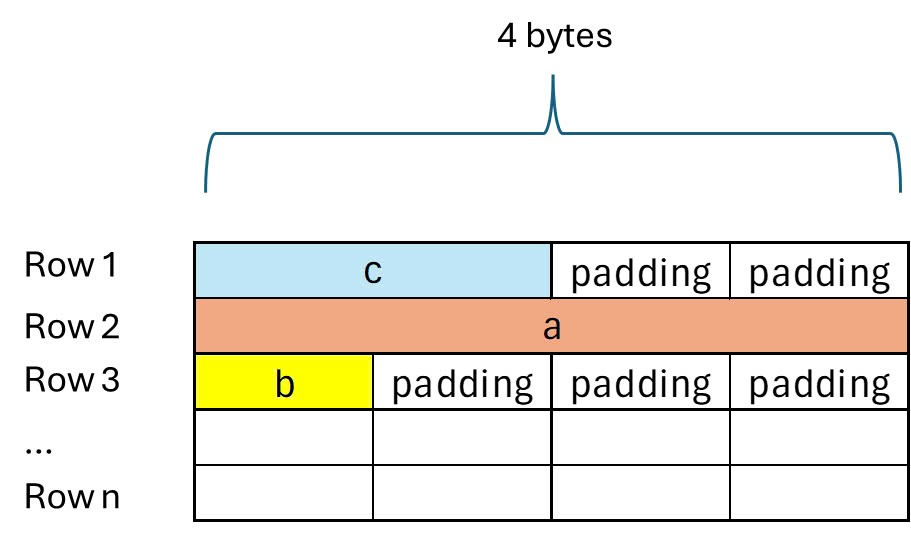
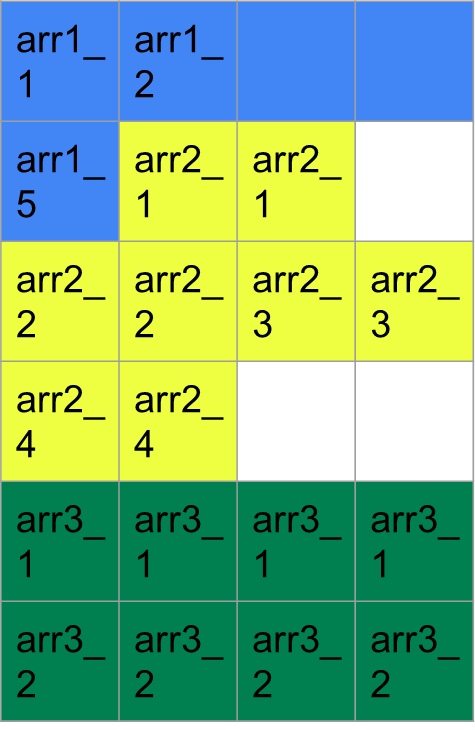

# Struct Union
## Struct
Struct là kiểu dữ liệu cho phép người dùng tự định nghĩa một kiểu dữ liệu mới bằng cách nhóm các biến có các kiểu dữ liệu khác nhau lại với nhau. Struct không sử dụng chung vùng nhớ.

**Cú pháp**
```c
struct TenStruct{
    data_type1 variable_name1;
    data_type2 variable_name2;
}
struct SinhVien {
    char ten[50];
    int tuoi;
    float diemthi;
}
```
Khai báo với tứ khóa ```typedef```
Sử dụng typedef để rút gọn việc 
```
typedef struct{
    char  name [50]; // 1byte
    int age;         // 4 byte
    float gpa;       // 4 byte
}Student;

Student student1,studen2
;
```
Khi sử typedef, mỗi khi khai báo chỉ cần dùng tên ```Student```

**Kích thước của struct**
Kích thước struct sẽ được tính bằng cách đựa vào kích thước lớn nhất của kiểu dữ liệu trong struct để cấp phát ô nhớ. Mối lần khong đủ cho kiểu dữ liệu thì sẽ được các ô nhớ và tính những ô nhỡ không lưu thành các padđing, chính bằng tổng số byte của các member + padding (nếu có).
Padding là thêm những byte trống giữa các thành phần để cho những địa chỉ phù hợp với dữ liệu căn chỉnh. 



**Ví dụ**
```c
#include <stdio.h>
#include<stdint.h>
struct Example {
    uint8_t a;     // 1 byte
    uint16_t b;      // 2 bytes
    uint32_t c;     // 4 byte
};

int main() {
    printf("Size of struct Example: %zu bytes\n", sizeof(struct Example));
    return 0;
}
```

**Kết quả**
```c
Size of struct Example: 8 bytes
```
Mỗi lần sẽ được cấp ô phát 4 byte do kiểu dữ liệu unit32_t là kiểu dữ lớn nhất trong struct. 4 ô nhớ đầu tiên cấp phát sẽ được cấp phát cho kiểu uint8_t (1 byte) và uint16_t(2 byte) và có 1 padding, và kiểu uint 32_t sẽ được cấp phát 4 byte .

**Ví dụ**

```c

struct Example1 {
    uint8_t arr1[5];    
    uint16_t arr2[4];    
    uint32_t arr3[2];
};
```


Ở đây ta sẽ in kiểu ra liệu uint8_t arr1[5] thành 
Uint8_t arr1_1;
Uint8_t arr1_2;
Uint8_t arr1_3;
Uint8_t arr1_4;
uint8_t arr1_5;
tương tự làm với các biến kia thì ta sẽ tốn ```24 byte```.
## Union
Union là kiểu dũ liệu người dùng tự định nghĩa tương tự như struct. Khi khai báo một union, các thành phần của nó sẽ được lưu trữ tại cùng một địa chỉ bộ nhớ, nghĩa là chúng sẽ ghi đè lên nhau.
Điểm khác nhau giữa Unionn và Struct là tổng hợp các dữ liệu được khai báo bên trong + padding (nếu có). Còn về union thì kiểu dữ liệu lớn nhất + padding (nếu có).

**Ví dụ 1**
```c
#include<stdio.h>
#include<stdint.h>
union Data {
    uint8_t a;
    uint16_t b;
    uint32_t c;   
};
int main()
{
    printf("Size of Union Data: %zu bytes \n",sizeof(union Data) );
    return 0;
}
```
**Kết quả**
```c
Size of Union Data: 4 bytes 
```


 **Ví dụ**
 ```c
 #include<stdio.h>
#include<stdint.h>

typedef union{
    uint8_t arr1;
    uint32_t arr2;
    uint16_t arr3;
} frame;

int main (int argc, char const *argv[])
{
    printf("Size = %lu\n",sizeof(frame));

    frame data;

    // printf("Dia chi : %p\n",&data);

    printf("Dia chi data.var1: %p\n", &(data.arr1));
    printf("Dia chi data.var2: %p\n", &(data.arr2));
    printf("Dia chi data.var3: %p\n", &(data.arr3));
    
    data.arr1=5;
    data.arr2=15;
    data.arr3=20;
    
    printf("arr1 = %d\n",data.arr1);
    printf("arr2 = %d\n",data.arr2);
    printf("arr3 = %d\n",data.arr3);
}
 ```
 **Kết quả**
 ```c
 Size = 4
Dia chi data.var1: 000000000061FE1C
Dia chi data.var2: 000000000061FE1C
Dia chi data.var3: 000000000061FE1C
arr1 = 20
arr2 = 20
arr3 = 20
 ```
 **Giải thích** 
 Ở đây địa chỉ của biến arr1, biến arr2 và biến arr3 sẽ được cấp phát chung địa chỉ. Biến data.arr1 truy cập tới địa chỉ 000000000061FE1C và gán cho giá trị là 5, rồi biến data.arr2 truy cập vào địa chỉ và thay đổi giá trị thành 15 và cuối cùng sẽ thay đổi giá trị 20. và do cùng dùng chung 1 địa chỉ nên giá trị của 3 biến sẽ thành 20.
 **Ví dụ **
 ```c
 #include<stdio.h>
#include<stdint.h>

typedef union{
    uint8_t arr1;
    uint32_t arr2;
    uint16_t arr3;
} frame;

int main (int argc, char const *argv[])
{
    printf("Size = %lu\n",sizeof(frame));

    frame data;

    // printf("Dia chi : %p\n",&data);

    printf("Dia chi data.var1: %p\n", &(data.arr1));
    printf("Dia chi data.var1: %p\n", &(data.arr2));
    printf("Dia chi data.var1: %p\n", &(data.arr3));
    
    data.arr2=4294967294;

    
    printf("arr1 = %d\n",data.arr1);
    printf("arr2 = %lld\n",data.arr2);
    printf("arr3 = %d\n",data.arr3);
}
 ```
 **Kết quả**
 ```c
Size = 4
Dia chi data.var1: 000000000061FE1C
Dia chi data.var1: 000000000061FE1C
Dia chi data.var1: 000000000061FE1C
arr1 = 254
arr2 = 4294967294
arr3 = 65534
 ```
 **Giải thích**
 ```c
 Ở đây arr1 =254 vì nó lấy byte đầu tiên (0xFE) từ (0xFFFFFFFE), arr2 =65534 vì nó lấy hai byte đầu tiên (0xFFFE) từ (0xFFFFFFFE)  và arr3 = 4294967294 vì nó chiếm toàn bộ 4 bytes của 0xFFFFFFFE.
Tuy nhiên nếu arr1=4294967294 nó sẽ kết quả 
arr1 = 254
arr2 = 254
arr3 = 254
bởi nó chỉ lấy byte đầu tiên(0xFFFE) của bit 0xFFFFFFFE.
 ```

**Kết hợp Struct và union**
```c
tydef union {
    struct {
        uint8_t id[2];
        uint8_t data[4];
        uint8_t check_sum[2];
    }data;
    uint8_t frame[8];
}
```
Ở đây có 3 member trong struct và một member tạo ra mảng 8 byte, do union sử dụng chung vùng nhớ nên khi truyền data vào frame cũng có dữ liệu giống 
